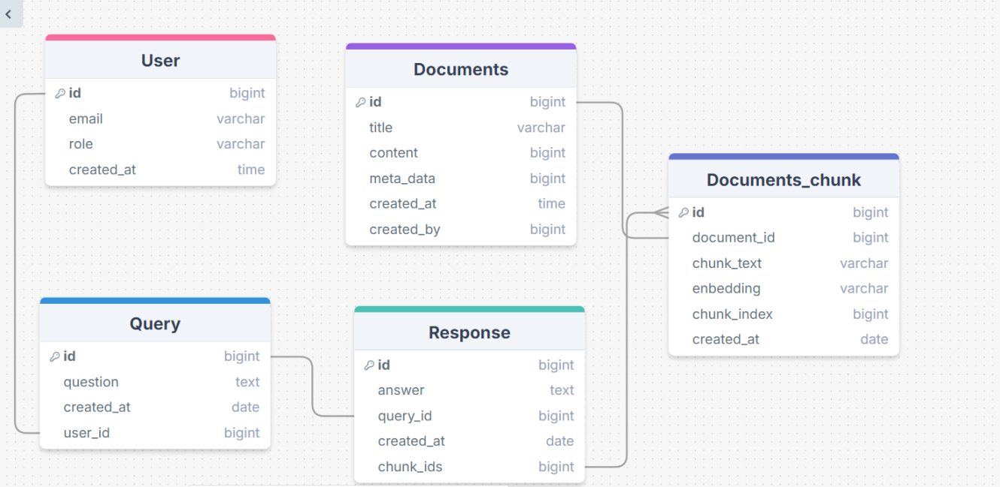
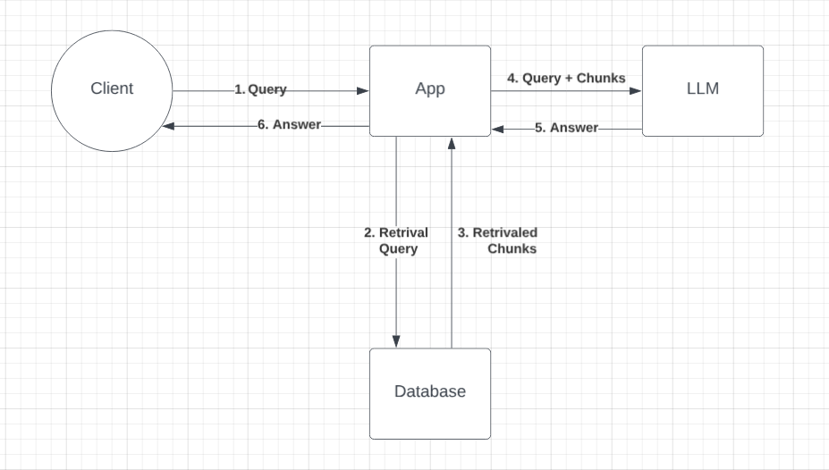

# RAG-IT-customer-service

## Purpose Of This Project
This project leverages AI to assist customers by providing prompt answers to their questions. By using RAG (Relevant Augmented Generation), we enhance ChatGPT's ability to generate accurate and helpful responses. The goal is to eliminate wait times for customers, allowing them to receive immediate assistance. We sourced the dataset from Kaggle, specifically focused on IT support, to train and fine-tune the AI for better accuracy and relevance in responses.

## How to run

### Prerequisites
Before running the backend, make sure you have the following installed:
- [Python](https://www.python.org/) (version 3.9 or higher)
- [FastAPI](https://fastapi.tiangolo.com/)
- [Uvicorn](https://www.uvicorn.org/)


- **Setup**:
    ```bash
    pip install -r requirements.txt
    ```
- **Running the Project (Backend)**:
    ```bash
    uvicorn api:app --reload
    ```
    1. Your backend server will now be running at `http://127.0.0.1:51798` by default. You can access it through your browser or Postman for testing the API endpoints.
- **Running the Project (Frontend)**:
    ```bash
    npm run dev
    ```

## Data Modeling


## System Design

